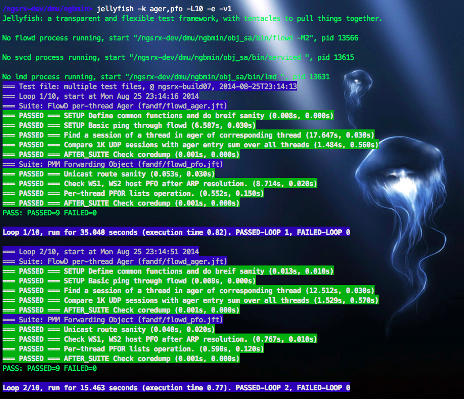
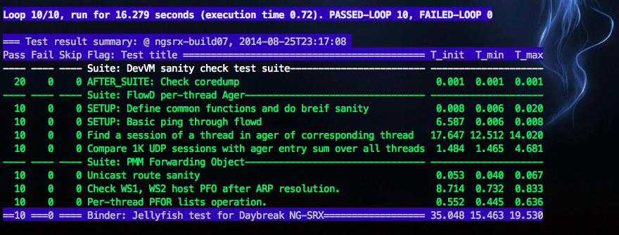
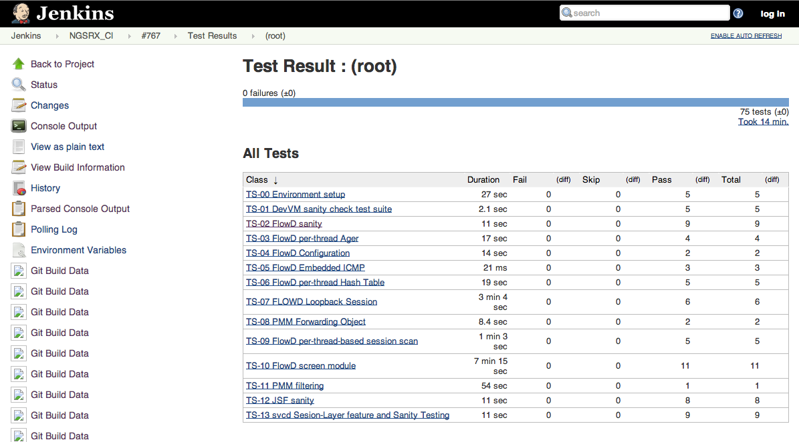
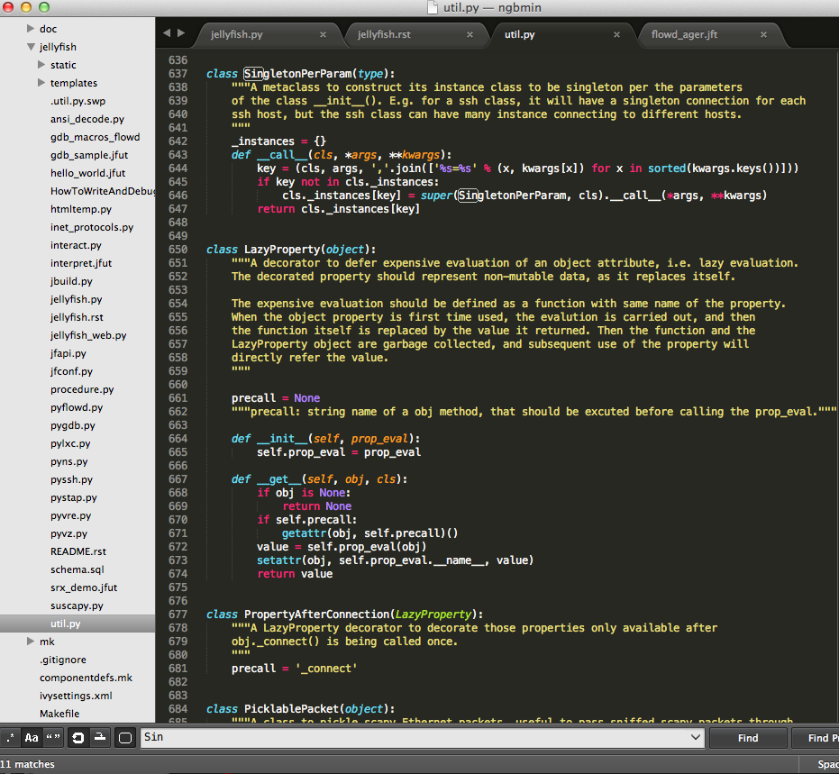

I truly believe that great software should be tested with white-box methodologies. For example, a network packet can successfully pass through a network device, but without white-box testing, we can not tell whether necessary security policy was involved to check the packet, whether the packet goes through the designed data path and the designed processing, whether the packet triggered unnecessary overhead, whether the packet was maliciously manipulated or modified, whether the packet had been sniffed or copied, whether the packet belongs to an attack flow, etc. etc.

In Juniper, while designing our next generation security gateway, I became passionate in building Dev Ecosystem that enables engineering efficiency. I single-handed developed a brand new test framework with Python. My daughter named it as Jellyfish. I love the name; Jellyfish is transparent, flexible, and has tentacles to pull things together. This framework provides white-box testing without the need of modifying target software source code to insert data collection points, provides developer unit-test without the need of doing separated component build or mocking the dependency. With the beauty and simplicity of Python language, it enables our C software developers to easily write their own dev-orientated white-box test cases. And, with the tentacle connections, it orchestrates test equipment and harnesses to perform sophisticated system level tests.

The framework was quickly adopted by 100+ developers for dev-testing, and was integrated into CI for rapid development and verification. There are 500+ test cases checked in, within the first 4 months of initial release. Jellyfish is designed with modern concepts. It doesn't repeat unnecessary procedures, it is concurrent, it performs time consuming setup/initialization only if a component is actually being first time used, and it doesn't use any hard-coded delay in test code. Our QA team immediately recognizes the speed of Jellyfish. Not before long, they started to develop their new tests with Jellyfish and even rewrote some old Perl based test cases with Jellyfish. Quoting from a QA engineer, "…with JT (old QA framework), I would start a test suite then go for lunch. When I'm back, the test may not complete yet, or occasionally ends up with a false failure. Jellyfish does the same test suite in a few minutes and reliably."

Sample execution with a few test cases seleted by keyword "ager" and "pfo". Notice that 2nd loop is faster than the 1st loop.

A summary of multi-loop run.

Intergrated with Jenkins CI, with JUnit report.

Code sample :-)
